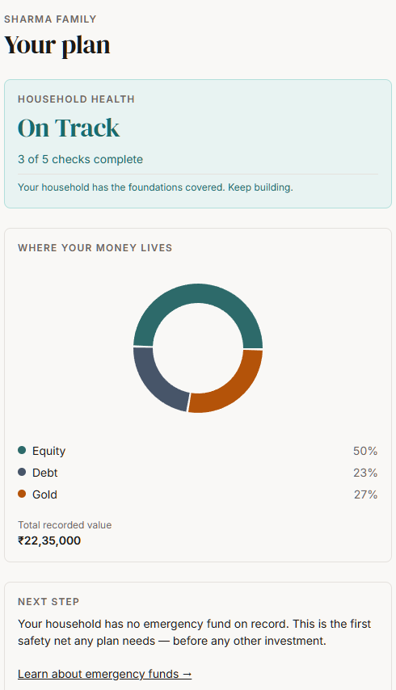

# Household Financial Planning PWA

**Live: https://finance.gauravg.dev** · [Why these choices? (in-app)](https://finance.gauravg.dev/why)



<sub>Captured live on 2026-08-01 from a synthetic household. This repo is public, so no real household data appears anywhere in it.</sub>

## What this is, and why

Indian households have no single place to learn what financial instruments exist, record what they actually
hold across family members, and see household-level plan gaps. The tools that exist are either single-account
trackers or generic robo-advisors — never both education-first and household-level. This is a public,
installable PWA that closes that gap for a whole household: parents, spouse, children, one plan. It is
deliberately **education, not advice** — every nudge is observational and links to a learn-card, never to a buy
action. It is also a PM portfolio piece; the intended signal is craft and architecture rather than the
meta-narrative (`DECISIONS_LOG.md` D-007), so the code, the schema, and the deployed app are the artefact.

## Core user journey

A new user completes a 3-step, fact-only onboarding — household → family members → first holding — and lands on
a personal dashboard showing their real asset-class allocation donut, a Household Health tier, and one
prioritized nudge. The 30-instrument library (6 asset classes × 5 instruments) is reached secondarily via
Explore or via a nudge's learn-card; it never gates the path to first value.

Household Health is a fixed 5-check, equal-weight score — member coverage, an emergency-fund-equivalent
holding, both parents' protection logged, ≥3 of 6 asset classes held, and current values set on every holding —
resolving to a tier (Getting Started / On Track / Strong). The single inline nudge is always the first unmet
check in that fixed order, which keeps it deterministic and tunable by nobody.

## Stack

- **Frontend** — Vite · React 18 · TypeScript · Tailwind · shadcn/ui · Recharts · React Router
- **PWA** — vite-plugin-pwa (precached instrument library + last-known dashboard; read-only offline)
- **API** — Hono, deployed as Vercel Functions
- **Data** — Drizzle ORM over Neon serverless Postgres (7 tables)
- **Auth** — Clerk (hosted UI; sessions verified server-side against Clerk's JWKS via `jose`)
- **Observability** — PostHog for product analytics, Sentry for client errors (D-012; the dual-sink `analytics_events` table planned in D-005 was never built)
- **Hosting** — Vercel

## Architecture

```
React SPA (Vercel static)  ->  Hono API (Vercel Functions)  ->  Drizzle  ->  Neon Postgres
        |                              |
     Clerk session JWT  ------>  JWKS verification -> household_id scoping
```

The whole API is one catch-all Vercel Function (`api/[[...route]].ts`) mounting a Hono app; all route, lib and
server-test code lives in `server/` because Vercel treats every file directly under `api/` as its own deployable
function. Multi-tenancy is enforced at the application layer — Hono resolves `household_id` from the Clerk
session on every request and scopes each query to it, rather than relying on Postgres RLS. Analytics go to
PostHog only, through the single `track()` wrapper in `src/lib/analytics.ts`. D-005 planned a second internal
sink as well; it was never built, and D-012 records that decision rather than pretending otherwise.

## Documentation

| Document | What's in it |
|---|---|
| [`Documentation/product/CASE_STUDY.md`](Documentation/product/CASE_STUDY.md) | The PM case study — problem, decisions, what got cut, what shipped |
| [`Documentation/product/HOW_TO_USE.md`](Documentation/product/HOW_TO_USE.md) | User-facing guide, capability by capability (also served at `/docs`) |
| [`Documentation/solution/DECISIONS_LOG.md`](Documentation/solution/DECISIONS_LOG.md) | Append-only decision log; every entry names its rejected alternative |
| [`Documentation/solution/SOLUTION_BRIEF.md`](Documentation/solution/SOLUTION_BRIEF.md) | Approved v1 scope, non-goals, risk register, cost and kill budget |
| [`/why`](https://finance.gauravg.dev/why) | The same reasoning, in-app and readable without an account |

## Local development

Vite 6 sets the floor here — Node 18+ (20+ recommended). The repo pins no version.

```bash
npm install
npm run dev          # Vite dev server
```

Environment variables (names only — never commit values): `DATABASE_URL`, `VITE_CLERK_PUBLISHABLE_KEY`,
`CLERK_SECRET_KEY`, `CLERK_WEBHOOK_SECRET`, `VITE_POSTHOG_KEY`, `VITE_SENTRY_DSN`.

Database:

```bash
npm run db:generate  # generate migrations from the Drizzle schema
npm run db:migrate   # apply them
npm run db:seed      # seed the 30-instrument library (synthetic data only)
npm run db:studio    # Drizzle Studio
```

The gate before any commit — all three must be clean:

```bash
npm run test         # vitest run
npm run typecheck    # tsc -b --noEmit
npm run build        # tsc -b && vite build
```

`npm run lint` (ESLint) is available too. Never commit or seed real household financial data — this repo is
public by decision (D-004), so sample data must be synthetic.

## Project state

**Feature-complete and deployed.** All 11 slices (0–10) are built and live; the test suite is green
(310/310 at the last gate check) with typecheck and build clean, and all five screens scan 0 axe violations in
the live app.

Phase 5 verification is **partially outstanding**, and every remaining item needs a human — Claude has
exhausted the autonomous work. Specifically:

- Human click-throughs still owed for Slices 2/4 (a fresh account past Clerk's Turnstile check into pristine
  onboarding), 5 (add-protection), 8 (offline steps 6–12), and 9 (destructive, needs a disposable account).
  Scripts are in `Documentation/testing/ACCEPTANCE_CRITERIA.md`.
- Two manual Clerk-dashboard steps for account deletion: register the `user.deleted` webhook with
  `CLERK_WEBHOOK_SECRET`, and enable self-service delete.
- Production currently runs Clerk **development** keys; a production Clerk instance with `pk_live`/`sk_live` in
  the Vercel Production environment is still required.

Known gaps: Vercel Preview-environment env vars are unset (Production only), `signup_failed`/`login_failed`
analytics events are unimplemented, and server-side Sentry capture is deferred — only the client is wired.
See the "Gate status" section of `CLAUDE.md` for the authoritative list.

---

Built with the Blueprint framework (rubric 3/5). Education, not financial advice.
